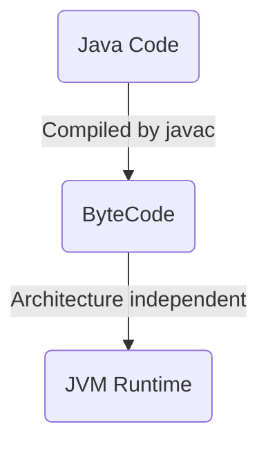
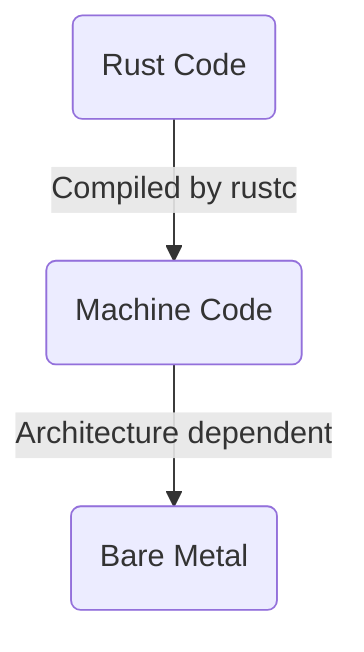

# Rust

George Roe - STFC

---
layout: center
---

<Toc minDepth="1" maxDepth="1" />

---

# Who Am I?

- Level 6 Degree Apprentice
  - MMU - Digital and Technology Solutions Professional
  - STFC - Software Engineer at Scientific Computing Department
- Completed my first year of my apprenticeship at a small web development company

---

# What is STFC?

- Science and Technology Facilities Council
- One of the nine councils under the management of UKRI (UK Research and Innovation)
- Formed in 2007 when several separate organisations were merged
- Many sites with two main campuses:
  - DL - Daresbury Laboratory (Warrington)
  - RAL - Rutherford Appleton Laboratory (Near Oxford)
- Focused on producing open access science by funding research grants

---

# Why Am I here?

How come I use rust?

I have been working on a CLI project for HPC systems: Essentially there is little to no carbon footprinting for jobs you have submitted to an HPC, and if there is, it is usually vendor specific/managed by admins. My goal was to make a portable script that can keep a log of your carbon emissions over time and provide reports.

I originally built this using python, but after getting past the stage of "this is just a small script" (mainly when the project started to be managed properly under the energy efficiency team) I started to be conscious of the fact that any part of my program can just throw an unchecked exception and there isn't much I can do about it. I was halfway through writing a small monad implementation for the project when I decided to make the leap.

{.h-[15vh]}

---

## About this talk

Given the popularity of Java with universities, I assume you will all be pretty familiar with Java's idioms and quirks. I will be comparing rust to java to show how it forces you to write better code.

### Why am I not comparing to C++?

1. In my profession, C++ is often *better* than rust due to the large amount of libraries for distributed computation (SYCL) which often make use of lots of *"unsafe"* code, which makes using rust pointless
2. I believe that rust is suited to the kind of projects you make in Java (e.g., backend systems, CLIs) so the comparison should be slightly more relevant
3. Java is used pretty much everywhere, and lots of rust code is rewrites of other projects

---
layout: center 
---

# Awesome Features

---
layout: comparison
---

## Algebraic Enums

Rust's enums are *algebraic data types*, meaning each variant can store data and represent different shapes of a type.

::left::

### Java - Enums are Value Sets

```java
enum Status {
  READY,
  RUNNING,
  FAILED;
}

switch (status) {
  case READY   -> System.out.println("Ready!");
  case RUNNING -> System.out.println("Running!");
  case FAILED  -> System.out.println("Failed!");
}
```

Java enums are basically a way to remove "magic numbers/strings". The only way Java can replicate ADTs is with sealed interfaces.

::right::

### Rust - Enums are ADTs

```rust
enum Status {
  Ready,
  Running(u64),
  Failed(String),
}

match status {
  Status::Ready => println!("Ready!"),
  Status::Running(n) => println!("Running! step: {n}"),
  Status::Failed(msg) => eprintln!("Failed! msg: {msg}"),
}
```

In rust, **invalid states are unrepresentable**.

---
layout: comparison
---

## No Inhertiance

Inheritance (not subtyping) is a horrible anti pattern that forces developers into corners that never needed to exist. Rust gets rid of inheritance entirely, relying on traits and implementations instead.

::left::

### Java - Inheritance

```java
// B and C inherit from A and both override doSomething

class D extends B, C {
  @Override
  public void doSomething() {
    B.super.doSomething();
    C.super.doSomething();
    // which one do I use?!?!
    // (double diamond problem)
  }
}
```

Although Java now has interfaces, inheritance is littered across the standard library (e.g., AWT/Swing).

::right::

### Rust - Traits

```rust
trait Greet {
  fn greet(&self);
}

struct Person {
  name: String
}

impl Greet for Person {
  fn greet(&self) {
    println!("Hello, {}!", self.name);
  }
}
```

Rust uses traits to create behavioural contracts on structs. Dynamic dispatch is possible using `Box<dyn Greet>` (heap allocation).

---
layout: comparison
---

## Tooling

Rust has some of the best, most cohesive tooling of any modern programming language.

::left::

### Java - Maven

```sh
sudo pacman -S jdk-openjdk
sudo pacman -S maven

mvn archetype:generate \
  -DgroupId=com.example \
  -DartifactId=my-app \
  -DarchetypeArtifactId=maven-archetype-quickstart \
  -DinteractiveMode=false

cd my-app

# manually edit
nvim pom.xml

mvn test
mvn exec:java -Dexec.mainClass="com.example.App"
```

Maven is often used for enterprise projects, however other projects use gradle for package management.

::right::

### Rust - cargo

```sh
curl --proto '=https' --tlsv1.2 \
  -sSf https://sh.rustup.rs | sh

cargo new my-app

cd my-app

# manually edit
nvim cargo.toml

# or install cargo extension
cargo install cargo-edit
cargo add some-package

cargo test
cargo run
```

I have never come across a rust project that isnt using vanilla cargo.

---
layout: center 
---

# Explicitness & Correctness by Default

---
layout: comparison
---

## Mutability

In Rust, values are immutable by default. You opt in to mutation, which helps prevent accidental state changes and enables stronger compile-time guarantees.

::left::

### Java - True Immutability Doesn't Exist

```java
int x = 5;
x = 10; // mutable by default

final int y = 5;
y = 10; // Error! Final cannot be overwritten

final List<Integer> values = new ArrayList<>();
values.add(new Integer(1)); // no error...
values = new ArrayList<>(); // Error!
```

Java only has `final`, which isn't even true immutability, it only refers to the variable not being able to be overwritten.

::right::

### Rust – Immutable by Default

```rust
struct Counter { count: i32 }

impl Counter {
  pub fn peek(&self) -> i32 {
    self.count
  }

  pub fn increment(&mut self) {
    self.count += 1;
  }
}

let counter = Counter { count: 0 };
println!("count: {}", counter.peek());
counter.increment(); // Error!
```

Rust forces you to declare mutability using `mut`.

---
layout: comparison
---

## Nullability

In rust `null` doesn't exist: if a value should be somewhere, it is, and it's impossible for it to not be.

::left::

### Java - Null Pointer Exceptions

```java
public class Example {
  public static void main(String[] args) {
    String result = fetchData();
    System.out.println(result.toUpperCase());
    // Runtime: NullPointerException
  }

  static String fetchData() {
    return null; // query failure / missing data
  }
}
```

Java doesn't prevent nulls from appearing where values are expected; it just throws errors at runtime.

::right::

### Rust - Option\<T\>

```rust
// This is built in
enum Option<T> {
  None,
  Some(T),
}

let something: Option<i32> = Some(1);
let nothing: Option<i32> = None;
```

If you expect that something might not have a value, you explicitly state that using the Option enum.

---
layout: comparison
---

## Results over Exceptions

There are no exceptions in rust, instead functions return Results, which can be either `Ok` or any type to represent an error.

::left::

### Java - Exceptions

```java
int parseInt(String s) {
    return Integer.parseInt(s); // throws Exception
}

try {
    int n = parseInt("abc");
} catch (NumberFormatException e) {
    System.out.println("Error!");
}
```

Exceptions can be checked to ensure that they are caught, however it is completely unique syntax and feels like a "bolt on".

::right::

### Rust - Result

```rust
fn parse_int(s: &str) -> Result<i32, ParseIntError> {
    s.parse()
}

let n = match parse_int("abc") {
    Ok(n) => n,
    Err(_) => {
        println!("Error!");
        0
    }
};
```

By adding errors to the return type it is more obvious what can and cannot fail. Just make sure to not be like Cloudflare and use `unwrap` in prod (rust equivalent of unchecked expections).

---
layout: center 
---

# Memory Safety & Resource Management

---
layout: comparison
---

## Memory Deallocation

Rust frees memory deterministically at compile time using ownership rules. This means there are no GC pauses and also no manual memory management (e.g., `free()`).

::left::

### Java — Garbage Collection

```java
Object data = new Object();
// Freed when GC decides
```

Memory is reclaimed unpredictably and may pause execution.

::right::

### Rust — Compiled

```rust
{
  let data = vec![1, 2, 3];
} // freed here immediately
```

Memory is released when values go out of scope leading to zero runtime cost.

---
layout: comparison
---

## Ownership

Rust has strict ownership rules to ensure code is safe.

::left::

### Java - Anyone can own anything

```java
class IntBox {
  public int value;

  public IntBox(int value) {
    this.value = value;
  }
}

IntBox a = new IntBox(1);
b = a; // Two references to the same object

a.value = 2;

System.out.println(b.value); // 2
```

It is not only possible, but very easy for two variables to point to the same instance. This can lead to data races.

::right::

### Rust - Strict Ownership

```rust
struct IntBox {
  pub value: i32
}

let mut a = IntBox { value: 1 };
let b = &mut a; // cannot have two mutable references

let c = &a; // both types of reference can't coexist

c.value = 2; // cannot mutate an immutable reference

let d = a;
println!("{}", a.value); // a's data has been moved
```

- At most one mutable reference can exist at a time
- Multiple immutable references are allowed
- Mutable and immutable references cannot coexist

---
layout: center 
---

# Performance & Control

---
layout: comparison
---

## Zero-cost Abstractions

In Rust you never have to choose between readable code and fast code, high level constructs compile into optimal machine code.

::left::

### Java - Runtime Streams

```java
var sum = list.stream()
  .map(x -> x * 2)
  .filter(x -> x > 10)
  .reduce(0, Integer::sum);
```

This creates Iterator objects and higher-level stream operations that may allocate and involve runtime overhead.

::right::

### Rust - Zero-cost Iterators

```rust
let sum: i32 = list.iter()
  .map(|x| x * 2)
  .filter(|x| *x > 10)
  .sum();
```

This compiles down to an optimized loop with no allocation and no runtime cost.

---
layout: comparison
---

## No Runtime, No Virtual Machines

Rust compiles to machine code directly, no intermediary language or runtime is required.

::left::

### Java - JVM



The JVM is required to run java code, if your machine doesnt have a jvm you cannot run Java code. JIT and other performance enhancements are used to try and compete with compiled languages.

::right::

### Rust - Bare Metal



You must know the architecture of the machine you are compiling for, trying to run ARM machine code on an X86 system will not work.

---
layout: comparison
---

## Data-Oriented

Rust encourages value-types and contiguous memory layouts, improving cache performance and enabling systems-level optimization.

::left::

### Java — Heap Objects + References

```java
class Point {
  int x, y;
}

// scattered in memory
Point[] points = new Point[n];
```

Objects live on the heap causing many allocations and poor locality.

::right::

### Rust - Struct Stored Contiguously

```rust
struct Point {
    x: i32,
    y: i32,
}

// packed in memory
let points = vec![Point { x: 1, y: 2 }; n];
```

Better cache locality leads to faster iteration with fewer allocations.

---
layout: center
---

# Other Important Notes

---

## Rust is loved

11% of professional developers have done extensive rust development in the last year.

Cargo makes up 15.2% of embedded systems technologies used (nearly overtaking clang).

Tauri, a popular rust alternative to Electron, represents 2.1% of "Other frameworks and libraries".

Rust is admired by 82% of all developers.

[StackOverflow Developer Survey](https://survey.stackoverflow.co/2024/technology#most-popular-technologies-language-prof)

---
layout: comparison
---

## Rust is Hard?

::left::

### Hard

- You must forget patterns you have taken for granted in other languages
- You must focus on smaller details (e.g., memory management)
- Ownership, borrowing, and lifetimes can feel overwhelming at first
- Errors must be fixed before code can even run
- Async programming has a steeper learning curve

::right::

### Easy

- Amazing documentation
- Good guides, e.g., [The Rust Book](https://doc.rust-lang.org/book/)
- Very active community
- Once you know rust you can do lots of projects:
  - Game development with [Bevy](https://bevy.org/)
  - CLI development with [Clap](https://docs.rs/clap/latest/clap/)
  - Desktop development with [Tauri](https://v2.tauri.app/)
  - Web development with [Dioxus](https://dioxuslabs.com/)
- If you have been programming well you would have already been following Rust's rules, now you just have a compiler to help you

---
layout: center
hideInToc: true
class: text-center
---

# Thank You

Any Questions?

{.h-[15vh].mx-auto}

https://georgeroe.github.io/rust-mmu-guest-lecture